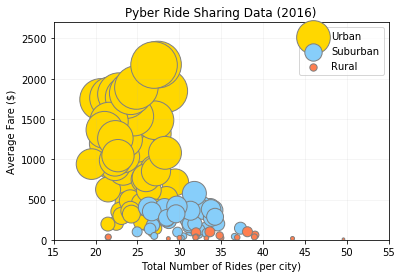
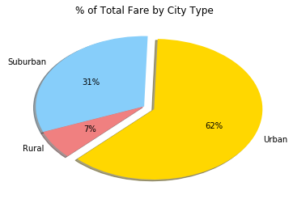
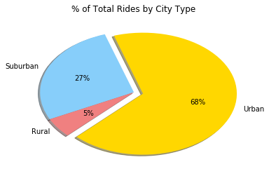
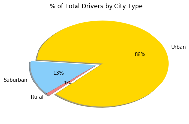

```python
# import depends
import os 
import pandas as pd
import matplotlib.pyplot as plt
import numpy as np
import csv
```


```python
# set csv paths 
city_data = "raw_data/city_data.csv"
ride_data = "raw_data/ride_data.csv"
```


```python
# read city data 
city_pd = pd.read_csv(city_data, low_memory=False)
```


```python
# rename and format columns in city data
city_data_form = city_pd.rename(columns={"city":"City", "driver_count": "Driver Count", 
                                                   "type":"Type"})
city_data_form.head()
```


<div>
<style>
    .dataframe thead tr:only-child th {
        text-align: right;
    }

    .dataframe thead th {
        text-align: left;
    }

    .dataframe tbody tr th {
        vertical-align: top;
    }
</style>
<table border="1" class="dataframe">
  <thead>
    <tr style="text-align: right;">
      <th></th>
      <th>City</th>
      <th>Driver Count</th>
      <th>Type</th>
    </tr>
  </thead>
  <tbody>
    <tr>
      <th>0</th>
      <td>Kelseyland</td>
      <td>63</td>
      <td>Urban</td>
    </tr>
    <tr>
      <th>1</th>
      <td>Nguyenbury</td>
      <td>8</td>
      <td>Urban</td>
    </tr>
    <tr>
      <th>2</th>
      <td>East Douglas</td>
      <td>12</td>
      <td>Urban</td>
    </tr>
    <tr>
      <th>3</th>
      <td>West Dawnfurt</td>
      <td>34</td>
      <td>Urban</td>
    </tr>
    <tr>
      <th>4</th>
      <td>Rodriguezburgh</td>
      <td>52</td>
      <td>Urban</td>
    </tr>
  </tbody>
</table>
</div>


```python
# read ride data
ride_pd = pd.read_csv(ride_data, low_memory=False)
```


```python
# rename and format columns in city data
ride_data_form = ride_pd.rename(columns={"city":"City", "date": "Date", 
                                         "fare":"Fare", "ride_id": "Ride ID"})
ride_data_form.head()
```


<div>
<style>
    .dataframe thead tr:only-child th {
        text-align: right;
    }

    .dataframe thead th {
        text-align: left;
    }

    .dataframe tbody tr th {
        vertical-align: top;
    }
</style>
<table border="1" class="dataframe">
  <thead>
    <tr style="text-align: right;">
      <th></th>
      <th>City</th>
      <th>Date</th>
      <th>Fare</th>
      <th>Ride ID</th>
    </tr>
  </thead>
  <tbody>
    <tr>
      <th>0</th>
      <td>Sarabury</td>
      <td>2016-01-16 13:49:27</td>
      <td>38.35</td>
      <td>5403689035038</td>
    </tr>
    <tr>
      <th>1</th>
      <td>South Roy</td>
      <td>2016-01-02 18:42:34</td>
      <td>17.49</td>
      <td>4036272335942</td>
    </tr>
    <tr>
      <th>2</th>
      <td>Wiseborough</td>
      <td>2016-01-21 17:35:29</td>
      <td>44.18</td>
      <td>3645042422587</td>
    </tr>
    <tr>
      <th>3</th>
      <td>Spencertown</td>
      <td>2016-07-31 14:53:22</td>
      <td>6.87</td>
      <td>2242596575892</td>
    </tr>
    <tr>
      <th>4</th>
      <td>Nguyenbury</td>
      <td>2016-07-09 04:42:44</td>
      <td>6.28</td>
      <td>1543057793673</td>
    </tr>
  </tbody>
</table>
</div>


```python
pyber = pd.merge(city_data_form, ride_data_form, on="City")
pyber.head()
```


<div>
<style>
    .dataframe thead tr:only-child th {
        text-align: right;
    }

    .dataframe thead th {
        text-align: left;
    }

    .dataframe tbody tr th {
        vertical-align: top;
    }
</style>
<table border="1" class="dataframe">
  <thead>
    <tr style="text-align: right;">
      <th></th>
      <th>City</th>
      <th>Driver Count</th>
      <th>Type</th>
      <th>Date</th>
      <th>Fare</th>
      <th>Ride ID</th>
    </tr>
  </thead>
  <tbody>
    <tr>
      <th>0</th>
      <td>Kelseyland</td>
      <td>63</td>
      <td>Urban</td>
      <td>2016-08-19 04:27:52</td>
      <td>5.51</td>
      <td>6246006544795</td>
    </tr>
    <tr>
      <th>1</th>
      <td>Kelseyland</td>
      <td>63</td>
      <td>Urban</td>
      <td>2016-04-17 06:59:50</td>
      <td>5.54</td>
      <td>7466473222333</td>
    </tr>
    <tr>
      <th>2</th>
      <td>Kelseyland</td>
      <td>63</td>
      <td>Urban</td>
      <td>2016-05-04 15:06:07</td>
      <td>30.54</td>
      <td>2140501382736</td>
    </tr>
    <tr>
      <th>3</th>
      <td>Kelseyland</td>
      <td>63</td>
      <td>Urban</td>
      <td>2016-01-25 20:44:56</td>
      <td>12.08</td>
      <td>1896987891309</td>
    </tr>
    <tr>
      <th>4</th>
      <td>Kelseyland</td>
      <td>63</td>
      <td>Urban</td>
      <td>2016-08-09 18:19:47</td>
      <td>17.91</td>
      <td>8784212854829</td>
    </tr>
  </tbody>
</table>
</div>


```python
# Average Fare ($) Per City
avg_fare_per_city = pyber.groupby(["City"]).mean()["Fare"]
```


```python
# Total Number of Rides Per City
total_rides_per_city = pyber.groupby(["City"]).count()["Fare"]
```


```python
# Total Number of Drivers Per City
total_drivers_per_city = pyber.groupby(["City"]).sum()["Driver Count"]
```


```python
# city type 
city_type = pyber.groupby("City")["Type"].first()
```


```python
# BUBBLE PLOT  
# * Average Fare ($) Per City
# * Total Number of Rides Per City
# * Total Number of Drivers Per City
# * City Type (Urban, Suburban, Rural)

bubble_summary_df = pd.DataFrame({"Average Fare ($) (per city)": avg_fare_per_city,
                                  "Total Number of Rides (per city)": total_rides_per_city, 
                                  "Total Number of Drivers (per city)": total_drivers_per_city,
                                  "City Type": city_type})
bubble_summary_df.head()
```


<div>
<style>
    .dataframe thead tr:only-child th {
        text-align: right;
    }

    .dataframe thead th {
        text-align: left;
    }

    .dataframe tbody tr th {
        vertical-align: top;
    }
</style>
<table border="1" class="dataframe">
  <thead>
    <tr style="text-align: right;">
      <th></th>
      <th>Average Fare ($) (per city)</th>
      <th>City Type</th>
      <th>Total Number of Drivers (per city)</th>
      <th>Total Number of Rides (per city)</th>
    </tr>
    <tr>
      <th>City</th>
      <th></th>
      <th></th>
      <th></th>
      <th></th>
    </tr>
  </thead>
  <tbody>
    <tr>
      <th>Alvarezhaven</th>
      <td>23.928710</td>
      <td>Urban</td>
      <td>651</td>
      <td>31</td>
    </tr>
    <tr>
      <th>Alyssaberg</th>
      <td>20.609615</td>
      <td>Urban</td>
      <td>1742</td>
      <td>26</td>
    </tr>
    <tr>
      <th>Anitamouth</th>
      <td>37.315556</td>
      <td>Suburban</td>
      <td>144</td>
      <td>9</td>
    </tr>
    <tr>
      <th>Antoniomouth</th>
      <td>23.625000</td>
      <td>Urban</td>
      <td>462</td>
      <td>22</td>
    </tr>
    <tr>
      <th>Aprilchester</th>
      <td>21.981579</td>
      <td>Urban</td>
      <td>931</td>
      <td>19</td>
    </tr>
  </tbody>
</table>
</div>


```python
bubble_summary_reset = bubble_summary_df.reset_index()
bubble_summary_reset.head()
```


<div>
<style>
    .dataframe thead tr:only-child th {
        text-align: right;
    }

    .dataframe thead th {
        text-align: left;
    }

    .dataframe tbody tr th {
        vertical-align: top;
    }
</style>
<table border="1" class="dataframe">
  <thead>
    <tr style="text-align: right;">
      <th></th>
      <th>City</th>
      <th>Average Fare ($) (per city)</th>
      <th>City Type</th>
      <th>Total Number of Drivers (per city)</th>
      <th>Total Number of Rides (per city)</th>
    </tr>
  </thead>
  <tbody>
    <tr>
      <th>0</th>
      <td>Alvarezhaven</td>
      <td>23.928710</td>
      <td>Urban</td>
      <td>651</td>
      <td>31</td>
    </tr>
    <tr>
      <th>1</th>
      <td>Alyssaberg</td>
      <td>20.609615</td>
      <td>Urban</td>
      <td>1742</td>
      <td>26</td>
    </tr>
    <tr>
      <th>2</th>
      <td>Anitamouth</td>
      <td>37.315556</td>
      <td>Suburban</td>
      <td>144</td>
      <td>9</td>
    </tr>
    <tr>
      <th>3</th>
      <td>Antoniomouth</td>
      <td>23.625000</td>
      <td>Urban</td>
      <td>462</td>
      <td>22</td>
    </tr>
    <tr>
      <th>4</th>
      <td>Aprilchester</td>
      <td>21.981579</td>
      <td>Urban</td>
      <td>931</td>
      <td>19</td>
    </tr>
  </tbody>
</table>
</div>


```python
# Urban Scatter Data 

urban = bubble_summary_reset.loc[bubble_summary_reset["City Type"] == "Urban",:]
avg_urban_fare = urban.groupby(["City"]).mean()["Average Fare ($) (per city)"]
urban_driver_count = urban.groupby(["City"]).sum()["Total Number of Drivers (per city)"]
udc = [i * 1 for i in urban_driver_count]

```


```python
# Suburban Scatter Data 
suburban = bubble_summary_reset.loc[bubble_summary_reset["City Type"] == "Suburban",:]
avg_suburban_fare = suburban.groupby(["City"]).mean()["Average Fare ($) (per city)"]
suburban_driver_count = suburban.groupby(["City"]).sum()["Total Number of Drivers (per city)"]
sudc = [i * 1 for i in suburban_driver_count]

```


```python
# Rural Scatter Data 
rural = bubble_summary_reset.loc[bubble_summary_reset["City Type"] == "Rural",:]
avg_rural_fare = rural.groupby(["City"]).mean()["Average Fare ($) (per city)"]
rural_driver_count = rural.groupby(["City"]).sum()["Total Number of Drivers (per city)"]
rdc = [i * 1 for i in rural_driver_count]

```


```python
urban_plt = plt.scatter(avg_urban_fare, urban_driver_count,
                        color="gold", edgecolor="grey",
                        label="Urban", s=udc)


subu_plt = plt.scatter(avg_suburban_fare, suburban_driver_count,
                       color="lightskyblue", edgecolor="grey",
                       label="Suburban", s=sudc)

rural_plt = plt.scatter(avg_rural_fare, rural_driver_count,
                        color="coral", edgecolor="grey",
                        label="Rural", s=rdc)


plt.ylim(0, 2700)
plt.xlim(15, 55)

# Prints the scatter plot to the screen 

plt.title("Pyber Ride Sharing Data (2016)")
plt.xlabel("Total Number of Rides (per city)")
plt.ylabel("Average Fare ($)")
plt.legend(loc="best")
plt.grid(alpha=.15)
plt.show()

```





```python
# Save the plot and display it
plt.savefig("Pyber_ride_sharing2016.png")
plt.show()
```


    <matplotlib.figure.Figure at 0x11932f390>


```python
# city type count 
city_type_count = city_type.value_counts()
```


```python
# Total Drivers by City Type
total_drivers_per_city_type = pyber.groupby(["Type"]).sum()["Driver Count"]
```


```python
# Total Fare ($) Per City
total_fare_per_city_type = pyber.groupby(["Type"]).sum()["Fare"]
```


```python
# Total Number of Rides Per City_Type
total_rides_per_city_type = pyber.groupby(["Type"]).count()["Fare"]
```


```python
# Chart for - % of Total Fares by City Type 

# Labels for the sections of our pie chart
labels = ["Urban", "Suburban", "Rural"]

# The values of each section of the pie chart
sizes = [40078, 20335, 4255]

# The colors of each section of the pie chart
colors = ["gold", "lightskyblue", "lightcoral"]

# Tells matplotlib to seperate the "Python" section from the others
explode = (0.1, 0, 0)
```


```python
plt.pie(sizes, explode=explode, labels=labels, colors=colors, autopct='%.f%%', shadow=True, startangle=225)
plt.title("% of Total Fare by City Type")
plt.show()
```





```python
# Chart for - % of Total Rides by City Type

# Labels for the sections of our pie chart
labels = ["Urban", "Suburban", "Rural"]

# The values of each section of the pie chart
sizes = [1625, 657, 125]

# The colors of each section of the pie chart
colors = ["gold", "lightskyblue", "lightcoral"]

# Tells matplotlib to seperate the "Python" section from the others
explode = (0.1, 0, 0)
```


```python
plt.pie(sizes, explode=explode, labels=labels, colors=colors, autopct='%.f%%', shadow=True, startangle=225)
plt.title("% of Total Rides by City Type")
plt.show()
```





```python
# Chart for - % of Total Rides by City Type

# Labels for the sections of our pie chart
labels = ["Urban", "Suburban", "Rural"]

# The values of each section of the pie chart
sizes = [64501, 9730, 727]

# The colors of each section of the pie chart
colors = ["gold", "lightskyblue", "lightcoral"]

# Tells matplotlib to seperate the "Python" section from the others
explode = (0.1, 0, 0)
```


```python
plt.pie(sizes, explode=explode, labels=labels, colors=colors, autopct='%.f%%', shadow=True, startangle=225)
plt.title("% of Total Drivers by City Type")
plt.show()
```





```python

```


```python

```
